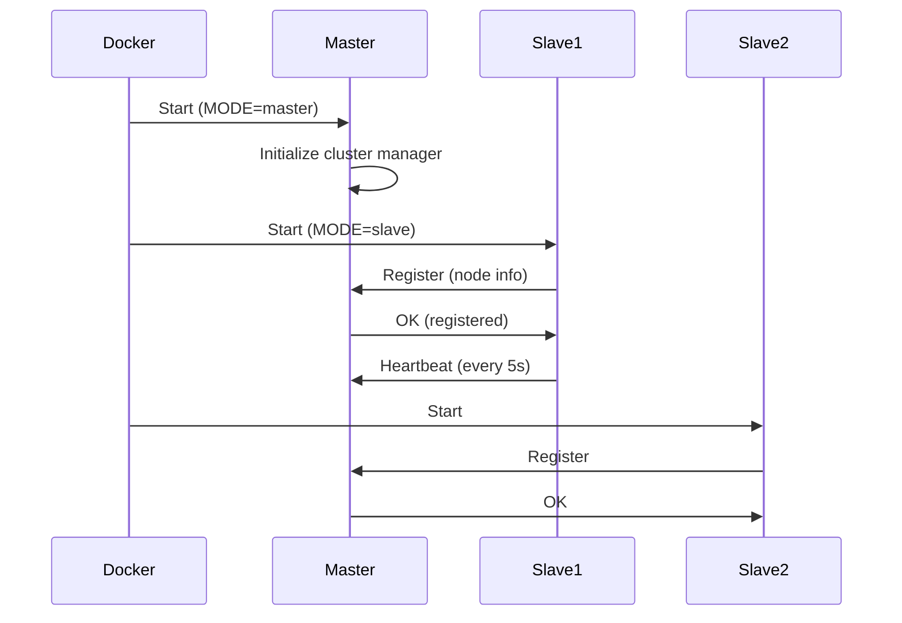
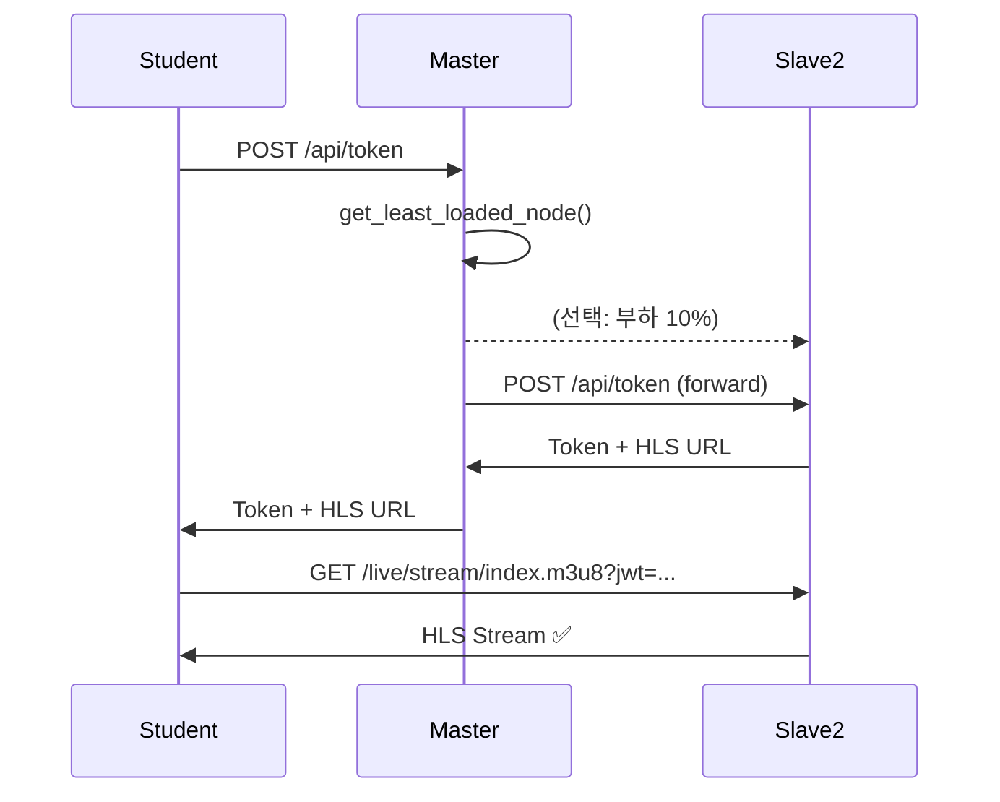
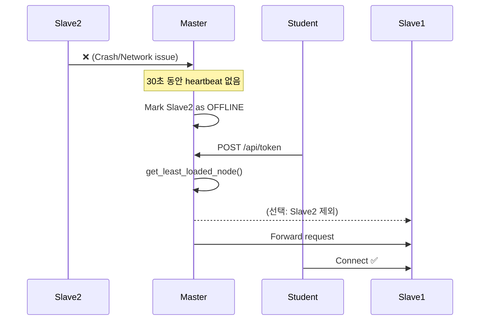

# AIRClass Cluster Architecture 🏗️

**자동 확장되는 Master-Slave 스트리밍 시스템**

---

## 🎯 핵심 개념

### 문제
- 단일 서버는 네트워크 대역폭 제한으로 **150명**까지만 수용 가능
- 500명 이상 동시 접속 시 서버 추가 필요
- 수동으로 서버 설정 및 관리는 복잡함

### 해결책
**Master-Slave 아키텍처 + Docker로 자동화**

```
                [Master Node]
           (트래픽 라우터 & 오케스트레이터)
                     |
      +--------------+---------------+
      |              |               |
  [Slave 1]     [Slave 2]       [Slave 3]
   150명         150명            150명
```

**특징**:
- ✅ 자동 로드 밸런싱
- ✅ 자동 장애 감지
- ✅ 무중단 확장
- ✅ Docker로 1분 배포

---

## 🏗️ 아키텍처

### Master Node

**역할**:
1. **라우팅**: 학생 접속 시 최적의 Slave 선택
2. **모니터링**: 모든 Slave의 상태 추적
3. **헬스 체크**: 장애 노드 자동 제외
4. **토큰 발급**: JWT 토큰 생성 및 검증

**API 엔드포인트**:
```
POST /api/token                  # 토큰 발급 (자동 Slave 선택)
POST /cluster/register           # Slave 등록
POST /cluster/stats              # Slave 상태 업데이트
GET  /cluster/nodes              # 클러스터 상태 조회
GET  /cluster/best-node          # 최적 노드 선택
GET  /health                     # 헬스 체크
```

**로드 밸런싱 알고리즘**:
```python
def get_least_loaded_node():
    """부하가 가장 적은 Slave 선택"""
    healthy_nodes = [n for n in nodes if n.is_healthy]
    
    # 부하율 = (현재 접속자 / 최대 수용) * 100
    return min(healthy_nodes, key=lambda n: n.load_percentage)
```

### Slave Node

**역할**:
1. **스트리밍**: RTMP 수신 → HLS 변환
2. **Heartbeat**: 5초마다 Master에 상태 보고
3. **자동 등록**: 시작 시 Master에 자동 등록
4. **자동 해제**: 종료 시 Master에서 자동 제거

**제공 서비스**:
- RTMP 입력: `:1935/live/stream`
- HLS 출력: `:8888/live/stream/index.m3u8`
- API: `:8000`

**Heartbeat 프로토콜**:
```json
{
  "node_id": "slave-1",
  "stats": {
    "connections": 45,
    "cpu": 25.5,
    "memory": 35.2
  }
}
```

**상태 전환**:
```
[Starting] → [Registering] → [Healthy]
                                  ↓
                          [Warning] (70% 부하)
                                  ↓
                          [Critical] (90% 부하)
                                  ↓
                          [Offline] (30초 무응답)
```

---

## 🔄 동작 흐름

### 1. 시스템 시작



### 2. 학생 접속



**자동 분산 예시**:
```
접속자 0명:
  Slave 1: 0명 (0%)   ← 다음 학생
  Slave 2: 0명 (0%)
  Slave 3: 0명 (0%)

접속자 150명:
  Slave 1: 50명 (33%)  ← 다음 학생
  Slave 2: 50명 (33%)
  Slave 3: 50명 (33%)

접속자 450명:
  Slave 1: 150명 (100%) 
  Slave 2: 150명 (100%)
  Slave 3: 150명 (100%) 
  → Slave 추가 필요!
```

### 3. Slave 장애 처리



### 4. 무중단 확장

```bash
# 명령어 실행
docker-compose up -d --scale slave=5

# 자동 진행:
1. Docker가 새 Slave 컨테이너 2개 시작
2. 새 Slave가 Master에 자동 등록
3. Master가 즉시 로드 밸런싱에 포함
4. 다음 접속부터 새 Slave로 자동 분산

# 결과: 450명 → 750명 수용
```

---

## 📊 성능 특성

### 단일 Slave 성능

| 항목 | 값 | 비고 |
|------|---|------|
| 최대 동시 접속 | 150명 | 설정 가능 |
| CPU 사용률 | 20-30% | i5-10400 기준 |
| 메모리 사용 | 2-3 GB | 16GB 권장 |
| 네트워크 대역폭 | 240 Mbps | 720p 기준 |
| 지연시간 | 7-8초 | HLS 특성 |

### 클러스터 성능

| Slave 수 | 최대 수용 인원 | 총 대역폭 | 비용 (중고 PC) |
|---------|---------------|----------|---------------|
| 1대 | 150명 | 240 Mbps | 30만원 |
| 3대 | 450명 | 720 Mbps | 90만원 |
| 5대 | 750명 | 1.2 Gbps | 150만원 |
| 10대 | 1500명 | 2.4 Gbps | 300만원 |

**vs Zoom (500명)**:
- AIRClass: 90만원 (1회 구매)
- Zoom: 월 500만원 → 연 6000만원 😱

---

## 🧠 로드 밸런싱 상세

### Least Load 알고리즘

```python
# 각 Slave의 부하율 계산
for slave in slaves:
    slave.load = slave.current_connections / slave.max_connections
    
# 가장 부하가 적은 Slave 선택
best_slave = min(slaves, key=lambda s: s.load)
```

**예시**:
```
Slave 1: 100/150 = 66.7%
Slave 2: 50/150 = 33.3%  ← 선택!
Slave 3: 120/150 = 80.0%
```

### Sticky Session (옵션)

스트림 ID 기반으로 항상 같은 Slave에 연결:

```python
def get_node_for_stream(stream_id: str):
    # 해시로 Slave 결정 (일관성 유지)
    slave_index = hash(stream_id) % len(healthy_slaves)
    return healthy_slaves[slave_index]
```

**장점**: 같은 교사 → 같은 Slave (캐시 효율)  
**단점**: 불균형 가능성

---

## 🔐 보안

### JWT 토큰 검증

```python
# Master가 토큰 생성
token = jwt.encode({
    "user_type": "student",
    "user_id": "홍길동",
    "exp": datetime.now() + timedelta(hours=1),
    "action": "read",
    "path": "live/stream",
    "node_id": "slave-2"  # 어느 Slave인지
}, SECRET_KEY)

# Slave가 토큰 검증
payload = jwt.decode(token, SECRET_KEY)
if payload["node_id"] != self.node_id:
    raise Unauthorized()  # 다른 Slave 토큰은 거부
```

### 네트워크 격리

```yaml
# docker-compose.yml
networks:
  airclass-network:
    driver: bridge
    internal: true  # 외부 인터넷 차단 (인트라넷만)
```

---

## 📈 모니터링

### 클러스터 상태 API

```bash
curl http://localhost:8000/cluster/nodes
```

```json
{
  "total_nodes": 3,
  "healthy_nodes": 3,
  "total_connections": 235,
  "total_capacity": 450,
  "utilization": 52.2,
  "nodes": [
    {
      "node_id": "slave-1",
      "node_name": "slave-1",
      "current_connections": 75,
      "max_connections": 150,
      "load_percentage": 50.0,
      "cpu_usage": 25.3,
      "memory_usage": 32.1,
      "status": "healthy",
      "last_heartbeat": "2026-01-22T10:30:45"
    },
    // ...
  ]
}
```

### 실시간 대시보드 (Grafana)

```bash
docker-compose up -d prometheus grafana
open http://localhost:3000
```

**메트릭**:
- 노드별 접속자 수
- CPU/메모리 사용률
- 네트워크 대역폭
- 에러율
- 평균 지연시간

---

## 🚨 장애 시나리오

### 시나리오 1: Slave 1대 다운

**상황**: Slave-2가 갑자기 종료

**자동 처리**:
1. Master가 30초 후 Slave-2를 OFFLINE으로 표시
2. Slave-2의 기존 학생 150명은 연결 끊김 (재접속 필요)
3. 새 접속은 Slave-1, Slave-3로만 분산
4. 전체 용량: 450명 → 300명

**복구**:
```bash
docker-compose restart airclass-slave-2
# 자동으로 Master에 재등록 → 다시 450명 수용
```

### 시나리오 2: Master 다운

**상황**: Master 서버가 다운

**영향**:
- ❌ 새 학생 접속 불가 (토큰 발급 불가)
- ✅ 기존 학생은 계속 시청 가능 (Slave에 직접 연결)
- ❌ Slave 상태 모니터링 불가

**복구**:
```bash
docker-compose restart master
# Slave들이 자동으로 재등록 → 정상화
```

### 시나리오 3: 전체 과부하 (450/450명)

**상황**: 모든 Slave가 100% 부하

**자동 처리**:
1. Master가 "critical" 상태로 표시
2. 새 접속 시도 시 여전히 분산 (공정하게)
3. 네트워크 지연 증가 가능

**해결**:
```bash
# Slave 2대 추가
docker-compose up -d --scale slave=5
# 30초 후 450명 → 750명 수용
```

---

## 🎓 Best Practices

### 1. Slave 개수 계산

```python
필요_인원 = 500
인당_대역폭 = 1.6  # Mbps (720p)
Slave당_수용 = 150

필요_Slave수 = ceil(필요_인원 / Slave당_수용)
            = ceil(500 / 150)
            = 4대

안전_여유 = 필요_Slave수 * 1.3  # 30% 여유
         = 5.2 → 6대 권장
```

### 2. 리소스 할당

```yaml
# 권장 설정
services:
  slave:
    deploy:
      resources:
        limits:
          cpus: '2.0'      # 2 코어
          memory: 2G       # 2GB RAM
        reservations:
          cpus: '1.0'      # 최소 1 코어 보장
          memory: 1G       # 최소 1GB 보장
```

### 3. 네트워크 설계

```
[학교 백본 스위치] (10 Gbps)
         |
    [VLAN 100] - AIRClass 전용
         |
    +----+----+----+
    |    |    |    |
 Master Slave Slave Slave
```

### 4. 백업 전략

```bash
# 매일 오전 2시 백업
0 2 * * * docker exec airclass-master \
  tar -czf /backup/airclass-$(date +\%Y\%m\%d).tar.gz \
  /app/mediamtx.yml /app/.env
```

---

## 🔮 향후 개선 방향

### 1. Kubernetes 지원
```yaml
apiVersion: apps/v1
kind: Deployment
metadata:
  name: airclass-slave
spec:
  replicas: 10  # Auto-scaling
  # ...
```

### 2. 지리적 분산
```
[서울 Master]
     |
  +--+--+
  |     |
[부산] [대전]
Slave  Slave
```

### 3. CDN 통합
```
Student → CDN Edge → Slave
(더 빠른 전송)
```

### 4. AI 기반 예측 확장
```python
# 과거 데이터로 미래 부하 예측
predicted_load = ml_model.predict(time, day_of_week)
if predicted_load > 0.8:
    scale_up(slaves + 2)
```

---

## 📚 참고 자료

- [Docker Deployment Guide](DOCKER_DEPLOYMENT.md)
- [Performance Analysis](PERFORMANCE_ANALYSIS.md)
- [Quick Start](../QUICKSTART.md)

---

**작성**: AIRClass 개발팀  
**버전**: 2.0.0  
**날짜**: 2026-01-22
